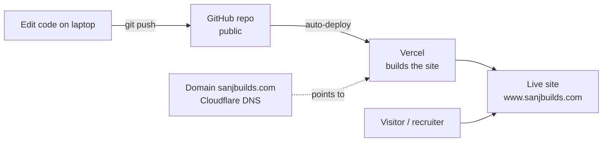
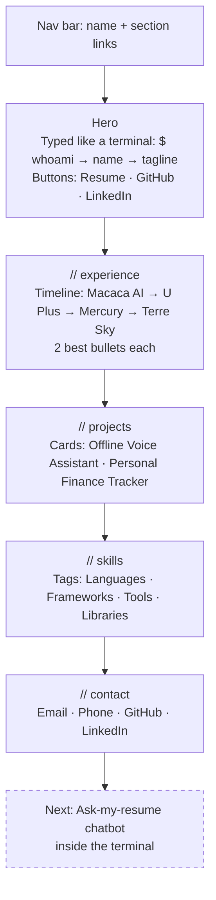
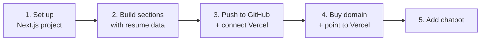
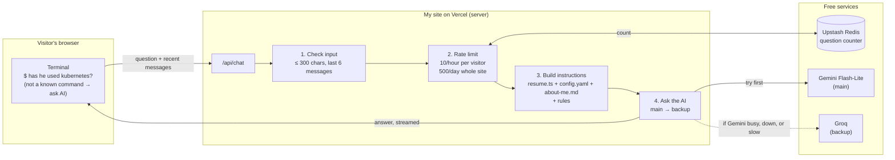

# Personal Website — Plan

A dark, techy one-page portfolio for Sanjay Subramanian, built from my resume.

## 1. Goal

A site that tells a visitor in about 30 seconds:

- **Who I am** — Math + AI student at the University of Waterloo.
- **What I've shipped** — 4 jobs and 2 projects, each with real numbers.
- **How to reach me** — email, GitHub, LinkedIn.

## 2. Decisions

| Topic | Decision | Why |
|---|---|---|
| Framework | Next.js + TypeScript | Next.js is a React-based tool for building websites. It's already on my resume, so the site itself proves the skill. |
| Styling | Tailwind CSS | Style with short class names (e.g. `text-cyan-400`) instead of separate CSS files. |
| Hosting | Vercel (free) | Pushing code to GitHub updates the live site automatically in about a minute. |
| Address | **sanjbuilds.com** (Cloudflare Registrar, $10.46/yr) | Short, brandable, at-cost pricing. DNS records point to Vercel. |
| Repo | Public on GitHub | Recruiters can see the code. |
| Theme | Dark and techy, **cyan** accent | Can be changed later from one place. |
| Content | `resume.ts` for resume, `config.yaml` for all settings | Adding a job means editing one list. Changing a link, phone number, or chatbot limit means editing one value. |
| Settings | One YAML file (`config.yaml`), no secrets in it | One place to change things without touching code. Secret keys stay in Vercel. |
| Chatbot | Free AI (Gemini, with Groq as backup) | Low traffic, so free plans are plenty. No credit card means no surprise bills. |

## 3. How it works



In plain words: I save and push code, GitHub stores it, Vercel turns it into a website, and visitors open the link. The domain just points at the same Vercel site.

## 4. Page layout (one scrolling page)



### Section details

- **Hero** — the first screen a visitor sees. `$ whoami`, the name, and the tagline type out like a terminal session, then the rest fades in.
- **Experience** — a vertical timeline. Each job shows title, company, dates, and the 2 strongest bullets, e.g. "Cut monthly cloud costs by $3,800."
- **Projects** — cards with name, tech used, 2 bullets, and a GitHub link. A demo GIF can be added later.
- **Skills** — tags grouped by category, not one long list.
- **Contact** — simple links. No form, so there's nothing extra to maintain.
- **Extras** — a terminal (press `` ` ``), a VS Code-style status bar, a faint grid background, and a hello message in the browser console.

## 5. Visual style

| Element | Choice |
|---|---|
| Background | Near-black `#0a0a0a` |
| Text | Light gray `#e5e5e5`, muted gray for secondary text |
| Accent | Cyan `#22d3ee` (easy to swap) |
| Fonts | Monospace for headings, clean sans-serif for body |
| Touches | `// section` headings like code comments, blinking cursor, soft cyan glow on card hover |

## 6. File structure

```
my-own-website/
├── PLAN.md                 ← this file
├── public/
│   └── resume.pdf          ← downloadable resume
└── src/
    ├── data/config.yaml    ← all settings: contact links + chatbot (edit here)
    ├── data/resume.ts      ← jobs, projects, skills (edit here)
    ├── app/
    │   ├── globals.css     ← colors (accent lives here)
    │   ├── layout.tsx      ← fonts, page title
    │   └── page.tsx        ← puts the sections together
    └── components/         ← sections + Terminal, StatusBar, TypedLines
```

### Settings file: `config.yaml`

All important settings live in **one YAML file**, `src/data/config.yaml`. YAML is a plain settings format of `name: value` lines. To change something, I edit a value and push, and the site updates in about 30 seconds. No code changes needed.

Today this file is `contact.yaml`. When the chatbot is built, it gets renamed to `config.yaml` and grows a `chatbot` section.

```yaml
# Contact info and links shown on the site
contact:
  email: "sanjaysubb2006@gmail.com"
  phone: "416-417-4309"
  github: "https://github.com/Sanjay617"
  linkedin: "https://www.linkedin.com/in/sanjay-subramanian-bb2615315/"
  # resume: "/resume.pdf"          # uncomment once public/resume.pdf exists

# Chatbot settings
chatbot:
  enabled: true                    # false = hide the AI, terminal still works
  main:
    provider: "gemini"
    model: "<Gemini Flash-Lite model ID>"   # exact ID confirmed at build time
  backup:
    provider: "groq"
    model: "<Groq model ID>"                # exact ID confirmed at build time
  limits:
    max_question_chars: 300        # longest question allowed
    history_messages: 6            # how many past messages the AI remembers
    per_visitor_per_hour: 10       # stops one person spamming
    site_per_day: 500              # stays under the free daily allowance
    max_answer_words: 300          # keeps answers short
```

**Rules for this file**

- **No secrets in it.** The repo is public, so anyone can read this file. API keys (Gemini, Groq, Upstash) go in Vercel → Settings → Environment Variables only.
- **Checked when the site builds.** If a value is missing or the wrong type (e.g. `per_visitor_per_hour: "ten"`), Vercel refuses to publish and names the bad line, instead of putting a broken site online.
- **Resume content stays in `resume.ts`.** Jobs and projects are long lists with bullet points, which are easier to edit there. `config.yaml` is for settings and links.

## 7. Build steps



| Step | Done when |
|---|---|
| 1. Set up | Project runs locally with dark theme and fonts. |
| 2. Sections | All 5 sections show real resume content and look right on phone and desktop. |
| 3. Deploy | Live at a `*.vercel.app` link and updates on every push. |
| 4. Domain | Custom domain opens the site with HTTPS (the padlock). |
| 5. Chatbot | Visitor can ask "Has he used Kubernetes?" and get an answer from the resume. See section 8. |

## 8. Chatbot ("ask my resume")

Visitors type a question into the site's terminal and get an answer about me, streamed word by word. It runs entirely on free plans.

### Design



In plain words: the browser sends the question to my site's server. The server checks it, makes sure the visitor isn't spamming, gives the AI my resume plus some rules, and asks Gemini. If Gemini can't answer, it asks Groq instead. The answer streams back into the terminal.

### Pieces

| Piece | What it is | Where |
|---|---|---|
| Terminal hookup | Anything that isn't a built-in command becomes a question. `help` lists an `ask` command. | `src/components/Terminal.tsx` |
| `/api/chat` | An API route: a URL on my site that runs code instead of showing a page | `src/app/api/chat/route.ts` |
| Vercel AI SDK | Free library that talks to Gemini, Groq, and others the same way | npm dependency |
| Upstash Redis | Tiny free database that counts questions per visitor | Added through Vercel → Storage |
| `about-me.md` | Extra facts not on the resume (interests, what I'm looking for) | `src/data/about-me.md` |
| Settings | Models, limits, on/off switch | `config.yaml` → `chatbot` section (see section 6) |
| Secret keys | Gemini key, Groq key, Upstash keys | Vercel → Settings → Environment Variables (never in code or `config.yaml`) |

### Why this design

1. **Free, with no surprise bills.** Every service is on a free plan with no credit card. The worst case is "bot is busy," never a charge.
2. **Hard to break.** Free plans sometimes hit limits or go down. The automatic switch to Groq keeps the bot answering.
3. **Easy to change providers.** Free plans change often. With the AI SDK, switching provider is about a one-line change.
4. **No new servers.** It runs inside the existing Vercel site; the only addition is a tiny counter database.
5. **Safe.** Keys stay on the server, and all checks happen there. Browser code can be tampered with, so protection can't live there.
6. **Accurate and simple.** No RAG (searching documents before answering): my info is about 2 pages, so the AI always sees all of it.
7. **Fits the site.** Answers stream into the terminal like a real command running.

### Ruled out

| Alternative | Why not |
|---|---|
| Calling Gemini straight from the browser | The secret key would be public, and anyone could use up the free allowance |
| RAG / vector database | Overkill for about 2 pages of info |
| Counting visitors in server memory | Vercel runs many short-lived copies of the server, each with its own count, so spammers slip through |
| Separate backend server (e.g. Railway) | Extra service to maintain; Vercel already handles this |
| Paid APIs (Claude, OpenAI) | Not needed at this traffic level |

### Rules for the AI

- Only answer questions about Sanjay: experience, projects, skills, education, how to contact him.
- Only use the provided info. If something isn't there, say so and suggest emailing.
- Politely decline unrelated requests (homework, essays, code).
- Keep answers short: a few sentences, plain text that fits the terminal.

### Limits

These are the starting values. All of them can be changed in `config.yaml`.

| Limit | Value | Protects against |
|---|---|---|
| Question length | 300 characters | Huge inputs eating the free allowance |
| Conversation memory | Last 6 messages | Long chats growing without end |
| Per visitor | 10 questions/hour | One person spamming |
| Whole site | 500 questions/day | Staying under the free daily allowance |
| Answer length | About 300 words | Long, slow answers |

### Build steps

| Step | Who | Done when |
|---|---|---|
| 1. Get keys | Me (Sanjay) | Gemini key (Google AI Studio), Groq key, and Upstash Redis added in Vercel |
| 2. Write `about-me.md` | Me (Sanjay), or Claude drafts it | Short file with extra facts |
| 2b. `config.yaml` | Claude | `contact.yaml` renamed to `config.yaml` with a `chatbot` section, and the build fails clearly on bad values |
| 3. `/api/chat` with backup switch | Claude | A question returns a streamed answer, and turning Gemini off makes Groq answer |
| 4. Rate limits | Claude | The 11th question in an hour gets "slow down" |
| 5. Terminal hookup | Claude | Typing a question in the terminal shows a streamed answer |
| 6. Testing | Claude | Off-topic, made-up-fact, spam, and "Gemini down" cases behave as expected |

### Decisions made

- **Provider:** Gemini Flash-Lite as main, Groq as backup.
- **Data use:** OK that Google's free plan may use visitor questions to improve its models (the resume is public anyway).
- **No RAG:** everything goes into the AI's instructions.

## 9. Placeholders to fill in

- [x] LinkedIn URL
- [x] GitHub URL
- [ ] Resume PDF file
- [ ] Project GitHub links / demo GIFs

## 10. Out of scope for now

- Blog
- Contact form
- Light mode
