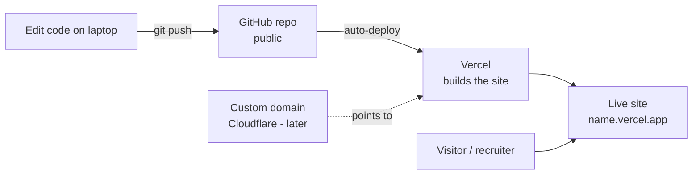
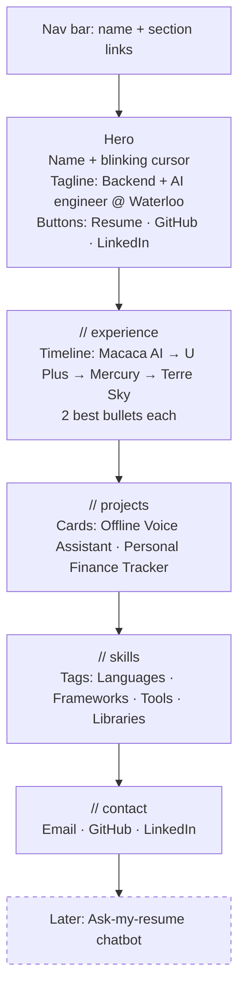
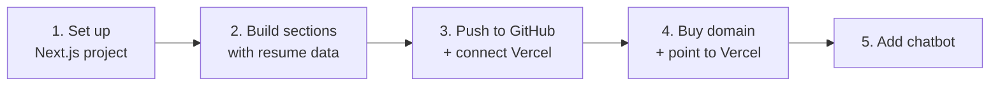

# Personal Website — Plan

A dark, techy one-page portfolio for Sanjay Subramanian, built from my resume.

## 1. Goal

A site that tells a visitor in about 30 seconds:

- **Who I am** — Math + AI student at the University of Waterloo.
- **What I've shipped** — 4 jobs and 2 projects, each with real numbers.
- **How to reach me** — email, GitHub, LinkedIn.

## 2. Decisions

| Topic | Decision | Why |
|---|---|---|
| Framework | Next.js + TypeScript | Next.js is a React-based tool for building websites. It's already on my resume, so the site itself proves the skill. |
| Styling | Tailwind CSS | Style with short class names (e.g. `text-cyan-400`) instead of separate CSS files. |
| Hosting | Vercel (free) | Pushing code to GitHub updates the live site automatically in about a minute. |
| Address | `*.vercel.app` for now, custom domain later | Free to start. A domain is roughly $10–11 a year when I'm ready. |
| Repo | Public on GitHub | Recruiters can see the code. |
| Theme | Dark and techy, **cyan** accent | Can be changed later from one place. |
| Content | One data file holds all resume info | Adding a job means editing one list, not the page layout. |

## 3. How it works



In plain words: I save and push code, GitHub stores it, Vercel turns it into a website, and visitors open the link. Later, a custom domain just points at the same Vercel site.

## 4. Page layout (one scrolling page)



### Section details

- **Hero** — the first screen a visitor sees. Name in a monospace font (every letter the same width, like code) with a blinking cursor.
- **Experience** — a vertical timeline. Each job shows title, company, dates, and the 2 strongest bullets, e.g. "Cut monthly cloud costs by $3,800."
- **Projects** — cards with name, tech used, 2 bullets, and a GitHub link. A demo GIF can be added later.
- **Skills** — tags grouped by category, not one long list.
- **Contact** — simple links. No form, so there's nothing extra to maintain.

## 5. Visual style

| Element | Choice |
|---|---|
| Background | Near-black `#0a0a0a` |
| Text | Light gray `#e5e5e5`, muted gray for secondary text |
| Accent | Cyan `#22d3ee` (easy to swap) |
| Fonts | Monospace for headings, clean sans-serif for body |
| Touches | `// section` headings like code comments, blinking cursor, soft cyan glow on card hover |

## 6. File structure (planned)

```
my-own-website/
├── PLAN.md                 ← this file
├── public/
│   └── resume.pdf          ← downloadable resume
└── src/
    ├── data/contact.yaml   ← email, phone, GitHub, LinkedIn, resume link (edit here)
    ├── data/resume.ts      ← jobs, projects, skills (edit here)
    ├── app/
    │   ├── globals.css     ← colors (accent lives here)
    │   ├── layout.tsx      ← fonts, page title
    │   └── page.tsx        ← puts the sections together
    └── components/         ← sections + Terminal, StatusBar, Typewriter
```

## 7. Build steps



| Step | Done when |
|---|---|
| 1. Set up | Project runs locally with dark theme and fonts. |
| 2. Sections | All 5 sections show real resume content and look right on phone and desktop. |
| 3. Deploy | Live at a `*.vercel.app` link and updates on every push. |
| 4. Domain | Custom domain opens the site with HTTPS (the padlock). |
| 5. Chatbot | Visitor can ask "Has he used Kubernetes?" and get an answer from the resume. |

## 8. Domain (later)

- **Where:** Cloudflare Registrar sells domains at cost: about $10–11 a year for `.com`.
- **Free option:** the GitHub Student Developer Pack includes a free domain for one year.
- **Avoid:** "$1 first year" deals that renew at $15 or more.
- **Options** (availability checked 2026-10-01; recheck before buying):

| Name | Status | Notes |
|---|---|---|
| `sanjaysubramanian.com` | Available | **Top pick.** Full name, `.com` is the most trusted. |
| `sanjaysubramanian.ca` | Available | Canadian. Cloudflare may not sell `.ca`, so it might need another registrar. |
| `sanjaysubb.com` | Available | Shorter, matches my email handle. |
| `sanjaysubramanian.dev` | Unknown | Techy feel. Check in Cloudflare. |

## 9. Placeholders to fill in

- [x] LinkedIn URL
- [x] GitHub URL
- [ ] Resume PDF file
- [ ] Project GitHub links / demo GIFs

## 10. Out of scope for now

- Chatbot (step 5)
- Blog
- Contact form
- Light mode
